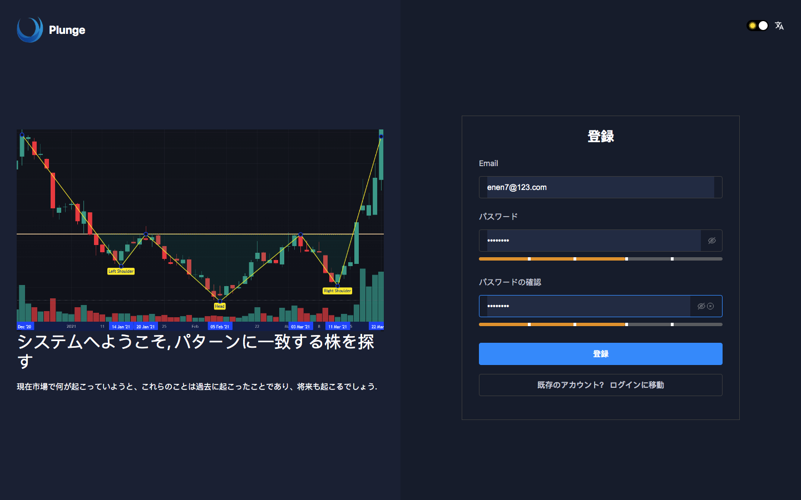
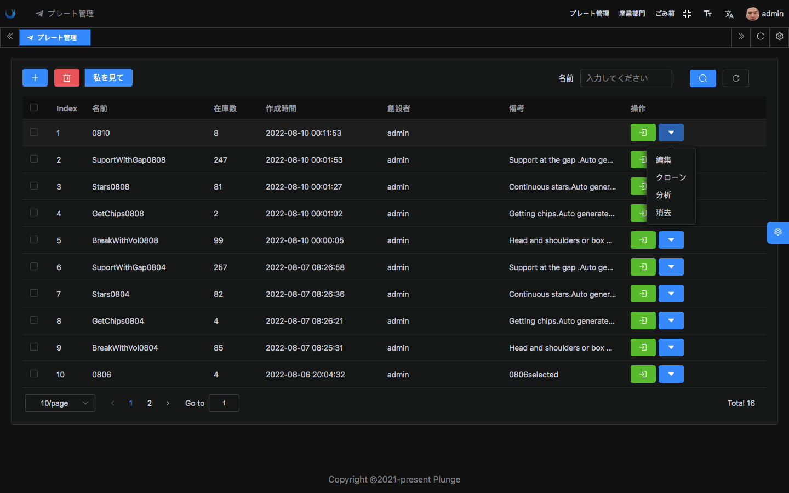
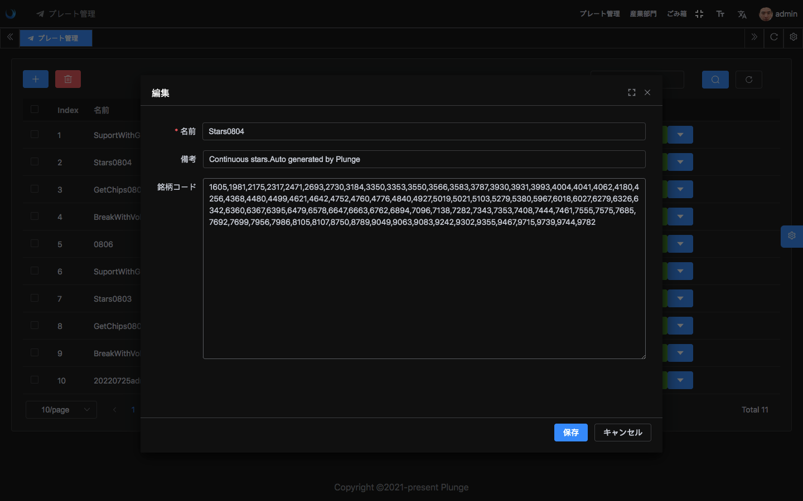
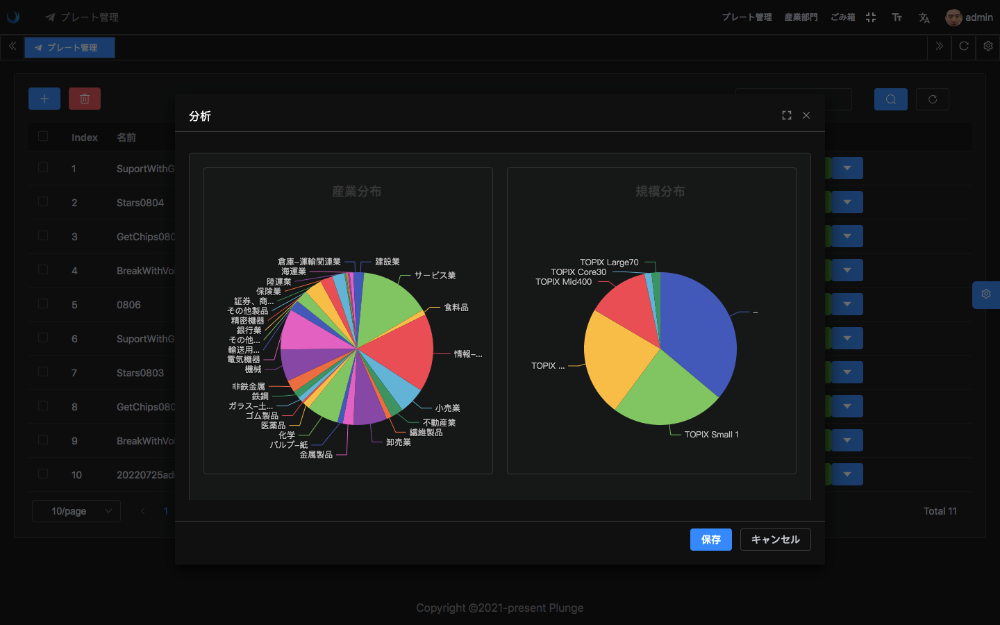
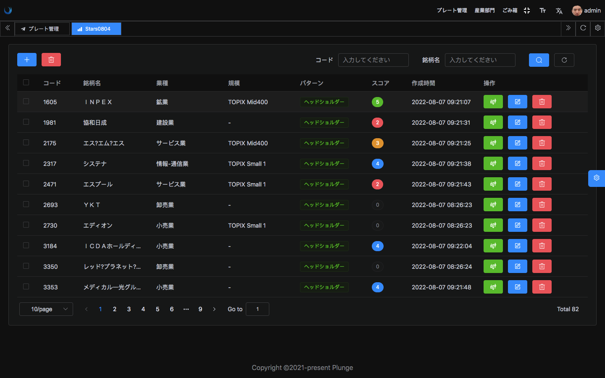
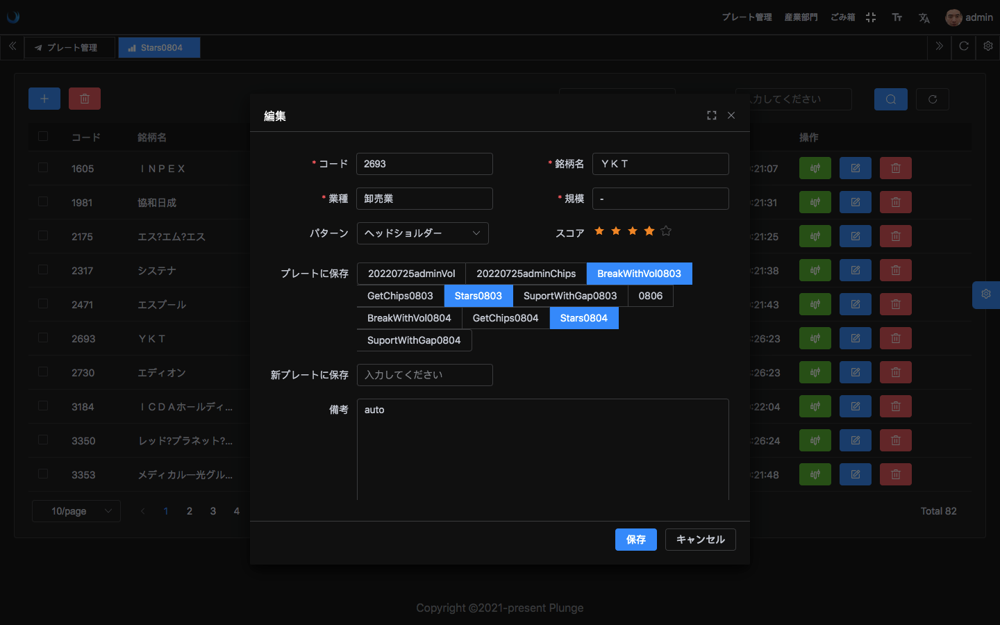
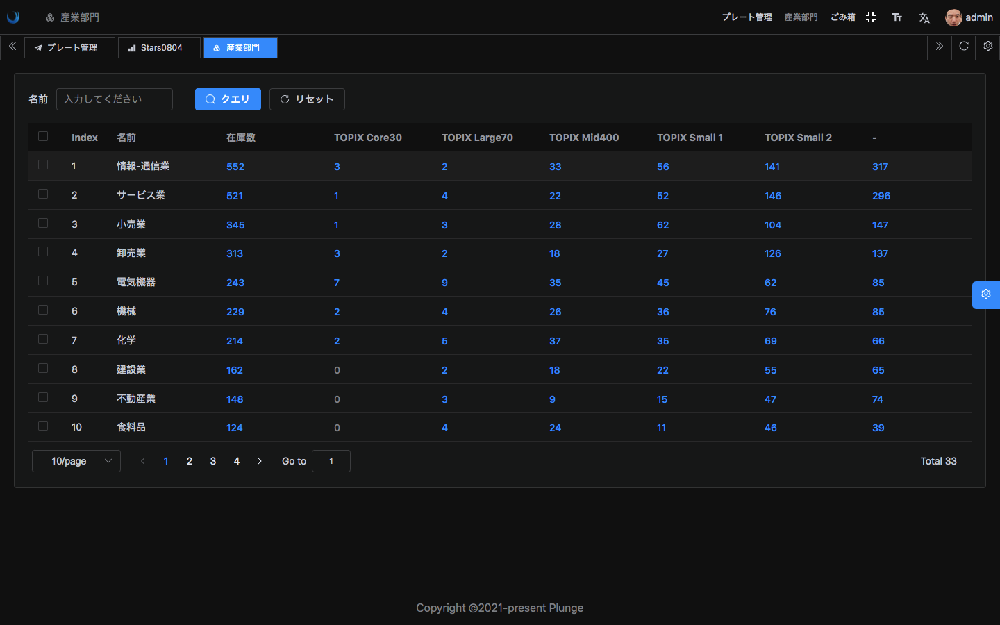
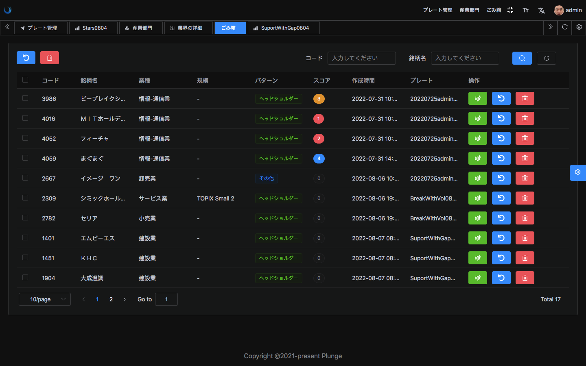

   

              
<h1>Plunge_API</h1>

## 紹介

Plunge_APIはフロントエンドにRestサービスを提供するエンジニアリングであり、データは[Plunge](https://github.com/Harvey-Specter/plunge)エンジニアリングが提供し、現在は日本の株式市場をサポートし、Lavavel9フレームワークに基づいて開発されている. データベース：[PostgreSQL](https://www.postgresql.org)

## 関連プロジェクト
[Plunge](https://github.com/Harvey-Specter/plunge) :  データ収集と処理,plunge_Apiにデータを提供する     
[plunge_ui](https://github.com/Harvey-Specter/plunge_ui) : このプロジェクトのフロントエンドインタフェース

## プレビュー

<figure>
   
   

</figure>

アカウント: `admin@gmail.com/123456` 
- <a href="https://plunge230724.onrender.com/" target="_blank">[plunge]完全版サイト，最初の訪問で少し遅い</a>

## ブラウザのサポート

ローカル開発の推奨使用` Chrome 80+`ブラウザ

現代ブラウザをサポートし、IEをサポートしない

|  IE |  Edge |  Firefox |  Chrome |  Safari |
| :-: | :-: | :-: | :-: | :-: |
| not support | last 2 versions | last 2 versions | last 2 versions | last 2 versions |

---

## Lic

[MIT](./LICENSE)

